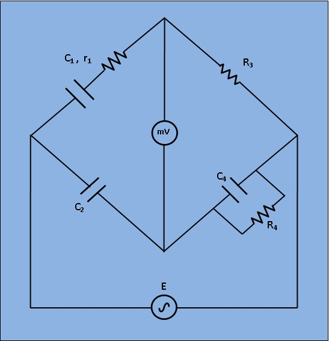

## Introduction

***Fig 1: Circuit diagram for measurement of Capacitance by Schering Bridge***

Let, `C_1`=capacitor whose capacitance is to be measured.
       `r_1`= a series resistance representing the loss in the capacitor `C_1`.
       `C_2`= a standard capacitor.
       `R_3`= a non inductive resistance.
       `C_4`= a variable capacitor.
       `R_4`= a variable non inductive resistance.
At balance,  

`(r_1+1/(jomegaC_1)) * (R_4 / (jomegaC_4R_4+1)) = R_3/(jomegaC_2)......(1)`

`r_1R_4-(jR_4)/(omegaC_1) = -(jR_3)/(omegaC_2) + (R_3R_4C_4)/C_2......(2)`
 

Or Equating the real and imaginary terms in equa. (2), we obtain

`r_1 = R_3*C_4/C_2......(3)`

`C_1 = R_4*C_2/R_3......(4)`
 

And, Two independent balance equations (3) and (4) are obatined if `C_4` and `R_4` are chosen as the variable elements.
Dissipation factor

`D_1 = omegaC_1r_1......(5)`
  

